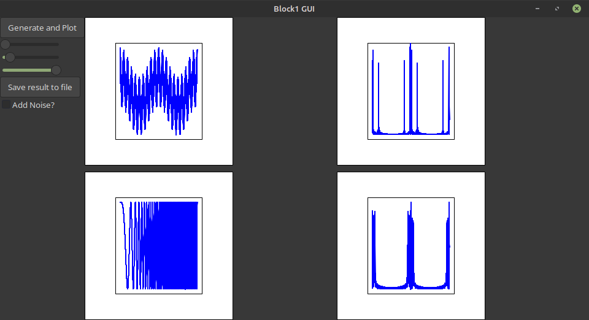

# FM Demo

this is me applying what i learned in signals and systems to a wxwidgets c++ project in order to visualize FM(Frequency Modulation). i got 50 and homework is past deadline so im improving it until its perfect and keeping it as a personal project

**WARNING** while open to public this may not be used in next semesters for EEE 302 project

**NOTE**: this project was made without AI agents

## current status
- plotting a 3 tone controlled message
- plotting modulated signal
- white noise
- working fft
- working fftshift
- half working demodulation and saving(python only)
- block 1 almost fully explained in writeup

# screenshot

# credits

- my professors for teaching me signals so well
- low level game dev for the amazing advice and code review
- stackoverflow and w3schools for teaching me c++ basics
- https://github.com/GitHubLionel/wxMathPlot for well working wxmathplot fork
